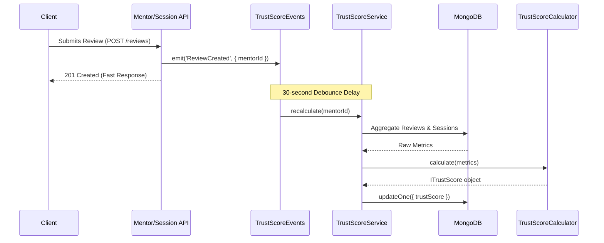

# Trust Score Backend

## 1. Introduction

The Trust Score subsystem is a core component of the Mentorship module designed to quantify a mentor's credibility, reliability, and overall quality. 

**Problem Solved:** Mentees need a reliable way to evaluate mentors before booking sessions. The Trust Score provides a standardized, objective metric.

**Backend Calculation:** The score is calculated exclusively on the backend to prevent tampering, ensure data integrity, and guarantee that complex aggregations (like past session histories and reviews) do not leak sensitive or large datasets to the client.

---

## 2. High Level Architecture

The Trust Score system integrates naturally into the existing Mentorship module, following a strictly decoupled and event-driven architecture.

- **`TrustScoreCalculator` (`utils/trustScoreCalculator.ts`)**: A pure mathematical engine responsible for computing the score and breakdown metrics safely, without any external side-effects (e.g., database calls).
- **`TrustScoreService` (`services/trustScore.service.ts`)**: The orchestration layer. Responsible for fetching raw mentor data, executing MongoDB aggregations for sessions and reviews, passing the aggregated metrics to the Calculator, and persisting the updated score.
- **`TrustScoreEvents` (`events/trustScore.events.ts`)**: An event emitter that listens for state changes (e.g., a review created or session completed) and triggers the TrustScoreService. It includes a debouncing mechanism to prevent redundant calculations.
- **`Types` (`interface/trustScore.types.ts`)**: Defines the unified `ITrustScore` schema (persisted to the DB) and `TrustScoreMetrics` (internal schema for the calculator).
- **`Constants` (`utils/trustScore.constants.ts`)**: Stores configurable weights, thresholds, and version information.
- **Mentor Model Integration**: The `Mentor` mongoose model has been extended with a `trustScore` field of type `ITrustScore`, ensuring the score is readily available during standard Mentor fetch operations.

---

## 3. Data Flow

The Trust Score is updated asynchronously via an event-driven flow to ensure API responsiveness is never degraded by heavy aggregations.



---

## 4. Calculation Algorithm

The Trust Score is a 100-point metric, strictly clamped between 0 and 100, composed of four heavily weighted dimensions.

- **Profile Completeness (20% Weight)**: 
  Checks for the existence of 5 key fields: Title, Bio (>= 50 chars), Domains, Skills, and Verification Status. Each field contributes 20% to this sub-score.
- **Reliability (40% Weight)**: 
  Measures the mentor's session completion rate. It calculates `completedSessions / totalSessions`. If a mentor has 0 sessions, this defaults safely to `100` so new mentors are not penalized.
- **Student Satisfaction (30% Weight)**: 
  Derived from the mentor's average review rating out of 5, normalized to a 100-point scale. If no reviews exist, defaults to `100`.
- **Engagement (10% Weight)**: 
  A tiered score based on the sheer volume of completed sessions (e.g., >=50 sessions = 100, >=20 = 80, >=5 = 50, >0 = 20, 0 = 0).

**Rounding & Safety**: All decimal values are safely rounded. Mathematical safeguards prevent `NaN` or `Infinity` by validating inputs and catching division-by-zero scenarios.

---

## 5. Event System

The event system uses a dedicated Node.js `EventEmitter` (`TrustScoreEvents`).

**Supported Events:**
- `ReviewCreated`, `ReviewUpdated`, `ReviewDeleted`
- `SessionCompleted`, `SessionCancelled`
- `GroupSessionCompleted`, `GroupSessionCancelled`
- `ProfileUpdated`, `VerificationUpdated`

**Debouncing & Idempotency:**
When multiple events fire rapidly for the same `mentorId` (e.g., a mentor completes multiple sessions in a batch), the system debounces the recalculation by **30 seconds**. This prevents redundant, expensive MongoDB aggregations and ensures idempotent persistence.

---

## 6. Database Changes

The existing `Mentor` Mongoose schema has been extended with a nested `trustScore` object.

```javascript
trustScore: {
  overall: { type: Number, min: 0, max: 100 },
  breakdown: {
    profileCompleteness: { type: Number },
    reliability: { type: Number },
    studentSatisfaction: { type: Number },
    engagement: { type: Number }
  },
  metrics: {
    totalCompletedSessions: { type: Number },
    totalCancelledSessions: { type: Number },
    averageRating: { type: Number },
    reviewCount: { type: Number }
  },
  version: { type: String },
  lastCalculatedAt: { type: Date }
}
```

---

## 7. API

### `GET /api/v1/mentorship/mentors/me/trust-score`

Retrieves the authenticated mentor's current Trust Score.

- **Authentication**: Required (`AuthMiddleware.authenticate`)
- **Authorization**: Mentor only (extracted from token)
- **Time Complexity**: O(1) (Fetches directly from the Mentor document, no aggregations performed on-read).

**Example Response:**
```json
{
  "success": true,
  "message": "Trust Score fetched successfully",
  "data": {
    "overall": 86,
    "breakdown": {
      "profileCompleteness": 80,
      "reliability": 100,
      "studentSatisfaction": 100,
      "engagement": 50
    },
    "metrics": {
      "totalCompletedSessions": 12,
      "totalCancelledSessions": 0,
      "averageRating": 5,
      "reviewCount": 3
    },
    "version": "1.0",
    "lastCalculatedAt": "2026-07-25T12:00:32.000Z"
  }
}
```
*Note: If the score has never been calculated, `data` will be `null` (this is expected for newly created mentors before the first recalculation).*

---

## 8. Backend Workflow

1. **Trigger Phase**: A mentee leaves a review. The `ReviewController` creates the review in the database and calls `TrustScoreEvents.emit('ReviewCreated', { mentorId })`.
2. **Debounce Phase**: `TrustScoreEvents` queues the recalculation for `mentorId`, overriding any existing pending timers for that mentor, and waits 30 seconds.
3. **Aggregation Phase**: After 30s, `TrustScoreService.recalculate(mentorId)` is invoked. It executes 3 parallel aggregations (Reviews, 1:1 Sessions, Group Sessions) to gather exact historical totals.
4. **Calculation Phase**: The raw metrics are mapped to `TrustScoreMetrics` and passed to `TrustScoreCalculator.calculate()`.
5. **Persistence Phase**: The resulting `ITrustScore` object is saved to the `Mentor` document via a localized `updateOne` call.

---

## 9. Migration

**Why it was needed**: Existing mentors in the database did not have a `trustScore` object, causing the frontend UI to display an empty state. 

**Script**: `src/Mentorship/scripts/migrateTrustScores.ts` iterates over all existing mentors and manually invokes `TrustScoreService.recalculate()` for each.

**Production Considerations**: This script should be executed once during the deployment window to backfill all historical mentors. Because it executes aggregations per mentor, it may take several minutes on a large production database and should ideally be executed via a background worker or during low-traffic hours.

---

## 10. Performance

- **O(1) Reads**: The `/me/trust-score` API is strictly O(1) because the Trust Score is pre-calculated and persisted directly on the Mentor document. 
- **Deferred Writes**: Aggregations are completely decoupled from user-facing requests. When a user submits a review, the API responds instantly. The heavy DB aggregations happen 30 seconds later in the background.

---

## 11. Error Handling

- **Database Failures**: If an aggregation fails during recalculation, the error is caught by `TrustScoreService`, logged via `LoggerUtil`, and safely swallowed so it does not crash the Node process or event loop.
- **Missing Data**: If a mentor is deleted before the debounce timer finishes, `TrustScoreService` aborts gracefully with a warning.
- **Math Safety**: Division by zero (e.g., 0 total sessions) is explicitly handled in the `TrustScoreCalculator` by returning safe, neutral defaults (e.g., 100% reliability).

---

## 12. Security

- **Server-side Authority**: The frontend has absolutely no ability to pass, update, or suggest Trust Score metrics.
- **Authorization**: The `/me/trust-score` endpoint extracts the `mentorId` securely from the decoded JWT token, preventing mentors from querying or scraping other mentors' granular Trust Score metrics.
- **Data Integrity**: By utilizing pure mathematical functions on the backend, the score cannot be manipulated through intercepted payloads.

---

## 13. Testing

The current subsystem is verified through:
- **Unit Tests**: Verifying the pure mathematics, bounds clamping, and safe defaults within `TrustScoreCalculator`.
- **Integration Tests**: Verifying that `TrustScoreService` successfully executes the required Mongoose aggregations and saves the expected output format.
- **API Tests**: Validating that the `GET /me/trust-score` endpoint strictly returns a 401 for unauthenticated users, 404 for non-existent profiles, and 200 with the correct schema for valid mentors.

---

## 14. Future Improvements

- **Scheduled Recalculation**: A nightly cron job to slowly decay scores for inactive mentors.
- **Historical Score Tracking**: Pushing historical scores into a `TrustScoreHistory` collection each time it recalculates, allowing for "Score Trends" graphs on the frontend.
- **Gamification Badges**: Automatically awarding badges (e.g., "Top Rated", "Highly Reliable") based on sub-score thresholds.
- **Administrative Audit Logs**: Storing a trace of exact metrics at the time of calculation for customer support dispute resolution.
